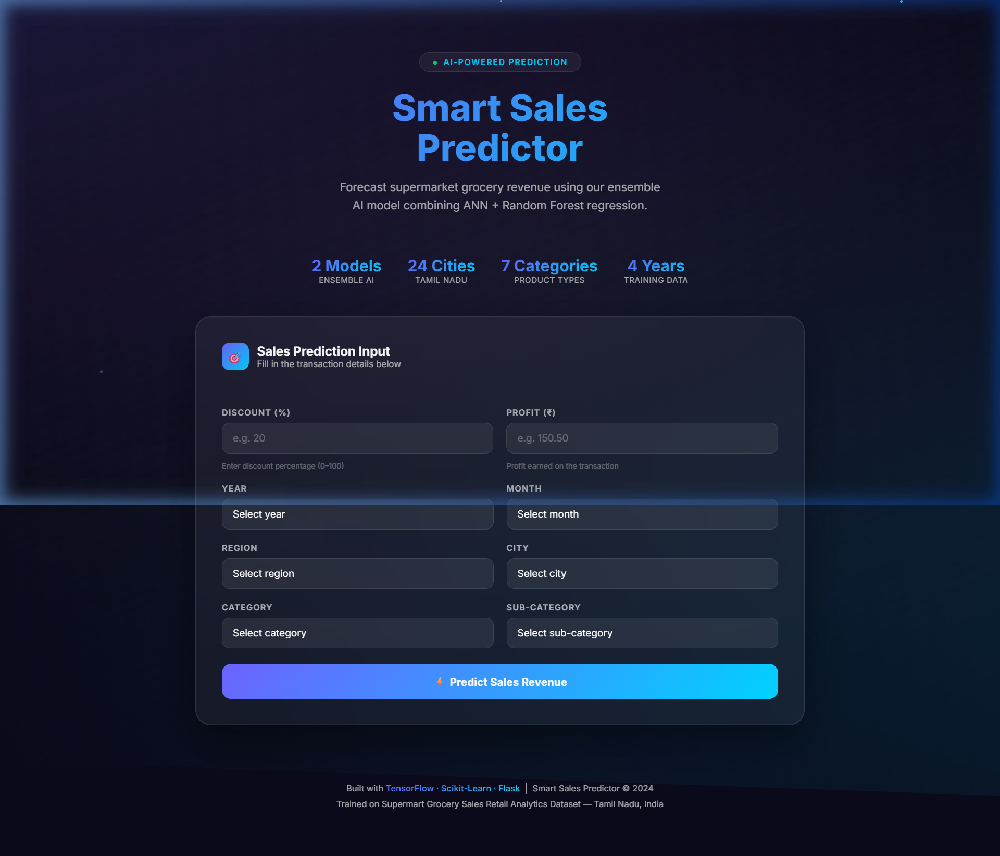
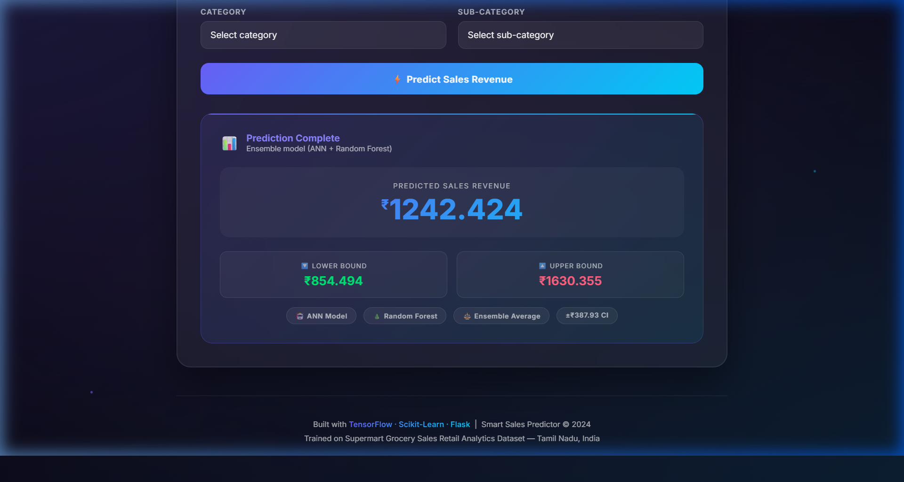

# 🛒 Smart Sales Predictor

> **AI-powered grocery sales revenue forecasting** for Tamil Nadu supermarkets using an ensemble of Artificial Neural Networks (ANN) and Random Forest Regression.

---

## 📸 Screenshots

### Homepage — Prediction Form


### Prediction Result


---

## 🎯 Overview

**Smart Sales Predictor** is a Flask web application that predicts supermarket grocery sales revenue based on transaction attributes. It combines two machine learning models — an ANN built with TensorFlow/Keras and a Random Forest Regressor from scikit-learn — into a powerful ensemble that averages their predictions for improved accuracy.

The model is trained on the **Supermart Grocery Sales Retail Analytics Dataset** covering 24 cities across Tamil Nadu, India, from 2015–2018.

---

## ✨ Features

- 🤖 **Ensemble AI Model** — ANN + Random Forest predictions averaged for better accuracy  
- 📊 **Confidence Interval** — Displays upper and lower bound (±₹387.93) around the prediction  
- 🌐 **24 Tamil Nadu Cities** — Full geographic coverage from Chennai to Kanyakumari  
- 🛍️ **7 Product Categories & 23 Sub-categories** — Covers all major grocery types  
- 🎨 **Premium Dark UI** — Glassmorphism design with animated particles and smooth interactions  
- ⚡ **Fast Flask Backend** — Real-time predictions served via a lightweight REST API  

---

## 🏗️ Tech Stack

| Layer | Technology |
|---|---|
| **Frontend** | HTML5, CSS3 (Glassmorphism), JavaScript |
| **Backend** | Python 3.12, Flask 3.0 |
| **ML Models** | TensorFlow/Keras (ANN), Scikit-learn (Random Forest) |
| **Data Processing** | Pandas, NumPy |
| **Encoders** | One-Hot Encoding via Scikit-learn (joblib) |
| **Dataset** | Supermart Grocery Sales Retail Analytics Dataset |

---

## 📂 Project Structure

```
Smart-Sales-main/
│
├── app.py                                  # Flask application entry point
├── requirements.txt                        # Python dependencies
│
├── templates/
│   └── index.html                          # Frontend UI (prediction form + results)
│
├── screenshots/
│   ├── homepage.png                        # Homepage screenshot
│   └── prediction_result.png              # Result page screenshot
│
├── Random_Forest_Regression.pkl            # Trained Random Forest model
├── ann_model.keras                         # Trained ANN model (TensorFlow/Keras)
│
├── catenc.pkl                              # Category encoder
├── subenc.pkl                              # Sub-category encoder
├── cityenc.pkl                             # City encoder
├── regenc.pkl                              # Region encoder
├── monthenc.pkl                            # Month encoder
├── yrenc.pkl                               # Year encoder
│
├── Supermart Grocery Sales - Retail Analytics Dataset.csv  # Raw dataset
└── supermarket (1).ipynb                   # Model training notebook
```

---

## 🚀 Getting Started

### Prerequisites

- Python 3.10–3.12
- pip

### 1. Clone the Repository

```bash
git clone https://github.com/your-username/Smart-Sales.git
cd Smart-Sales-main
```

### 2. Install Dependencies

```bash
pip install flask tensorflow pandas numpy joblib scikit-learn
```

> **⚠️ Windows Users:** TensorFlow requires Windows Long Path support. Run this in PowerShell as Administrator:
> ```powershell
> Set-ItemProperty -Path "HKLM:\SYSTEM\CurrentControlSet\Control\FileSystem" -Name "LongPathsEnabled" -Value 1
> ```
> Then reinstall TensorFlow.

### 3. Run the Application

```bash
python app.py
```

The app will start at **http://127.0.0.1:5000**

---

## 🧠 How It Works

### Input Features

| Field | Description | Type |
|---|---|---|
| **Discount (%)** | Discount percentage applied | Numeric (0–100) |
| **Profit (₹)** | Profit earned on the transaction | Numeric |
| **Year** | Transaction year | 2015–2018 |
| **Month** | Transaction month | 1–12 |
| **Region** | Sales region | West / East / Central / South / North |
| **City** | Tamil Nadu city | 24 cities |
| **Category** | Product category | 7 categories |
| **Sub-Category** | Product sub-category | 23 sub-categories |

### Prediction Pipeline

```
User Input → One-Hot Encoding → Feature Vector → ANN Predict + RF Predict → Ensemble Average → Sales Revenue
```

1. **Encoding** — Categorical features (City, Region, Category, etc.) are transformed using pre-fitted One-Hot Encoders (`.pkl` files).
2. **Feature Vector** — Numeric (Discount, Profit) and encoded features are concatenated.
3. **Dual Model Inference** — Both the ANN and Random Forest predict independently.
4. **Ensemble** — Final prediction = `(ANN output + RF output) / 2`
5. **Confidence Interval** — `Lower = prediction − 387.93`, `Upper = prediction + 387.93`

### Supported Categories

| Category | Sub-categories |
|---|---|
| Snacks | Cookies, Chocolates, Noodles, Biscuits |
| Beverages | Health Drinks, Soft Drinks |
| Bakery | Breads & Buns, Cakes |
| Oil & Masala | Edible Oil & Ghee, Masalas, Spices |
| Eggs, Meat & Fish | Mutton, Eggs, Fish, Chicken |
| Fruits & Veggies | Fresh Fruits, Fresh Vegetables, Organic Fruits, Organic Vegetables |
| Food Grains | Organic Staples, Atta & Flour, Dals & Pulses, Rice |

---

## 📈 Dataset

- **Source:** Supermart Grocery Sales Retail Analytics Dataset  
- **Coverage:** 24 cities in Tamil Nadu, India  
- **Time Period:** 2015 – 2018  
- **Features:** Category, Sub-Category, City, Region, Discount, Profit, Sales, Date  

---

## 🗺️ Covered Cities

| | | | |
|---|---|---|---|
| Chennai | Coimbatore | Madurai | Trichy |
| Salem | Vellore | Tirunelveli | Nagercoil |
| Kanyakumari | Ooty | Dindigul | Theni |
| Karur | Namakkal | Pudukottai | Perambalur |
| Krishnagiri | Dharmapuri | Viluppuram | Virudhunagar |
| Ramanadhapuram | Tenkasi | Cumbum | Bodi |

---

## ⚙️ API Reference

### `GET /`
Returns the prediction form homepage.

### `POST /predict`

**Form Fields:**

| Field name | Value |
|---|---|
| `discount` | Integer (0–100) |
| `profit` | Float |
| `year` | Integer (2015–2018) |
| `month` | Integer (1–12) |
| `region` | String |
| `category` | String |
| `subcategory` | String |
| `city` | String |

**Response:** Renders `index.html` with:
- `ans` — Predicted sales value (₹)
- `up` — Lower confidence bound (₹)
- `down` — Upper confidence bound (₹)

---

## 📓 Training Notebook

The model training process is documented in `supermarket (1).ipynb`, which covers:

- Exploratory Data Analysis (EDA)
- Feature Engineering & One-Hot Encoding
- ANN architecture design and training with TensorFlow/Keras
- Random Forest Regressor training with scikit-learn
- Model evaluation and export

---

## 🤝 Contributing

1. Fork the repository
2. Create your feature branch: `git checkout -b feature/my-feature`
3. Commit your changes: `git commit -m 'Add my feature'`
4. Push to the branch: `git push origin feature/my-feature`
5. Open a Pull Request

---

## 📄 License

This project is open-source and available under the [MIT License](LICENSE).

---

<p align="center">
  Built with ❤️ using <strong>TensorFlow · Scikit-Learn · Flask</strong><br>
  Trained on Supermart Grocery Sales Retail Analytics Dataset — Tamil Nadu, India
</p>